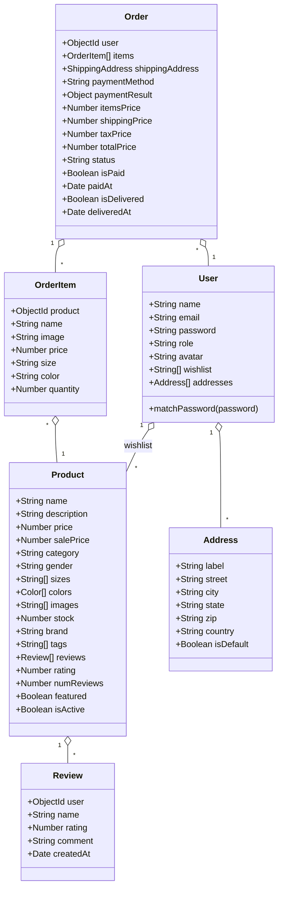
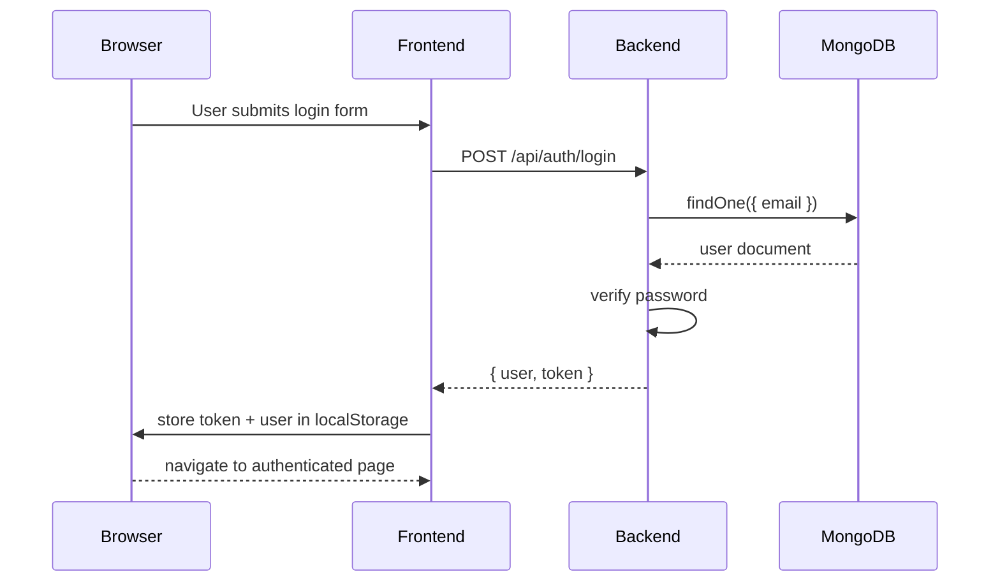
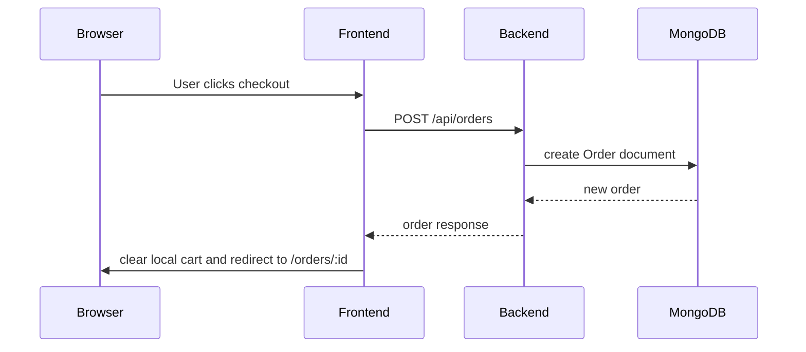
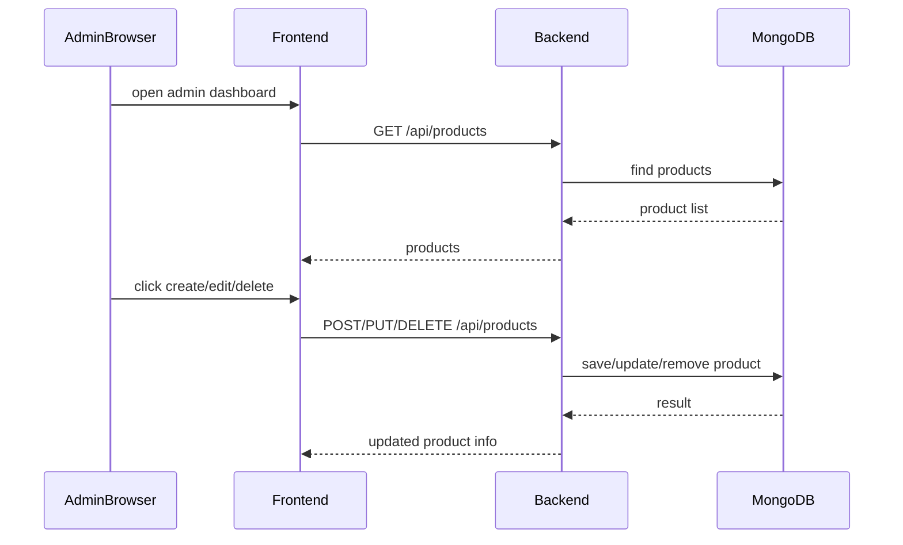

# UML Diagrams for MAISON Fashion E-Commerce

This document contains the main UML diagrams for the `ecommerce` website.

## 1. Use Case Diagram
```mermaid
usecaseDiagram
  actor Guest
  actor Customer as "Registered User"
  actor Admin

  Guest --> (Browse products)
  Guest --> (Search / filter products)
  Guest --> (View product details)
  Guest --> (Register)
  Guest --> (Login)

  Customer --> (Add product to cart)
  Customer --> (View cart)
  Customer --> (Checkout)
  Customer --> (View order history)
  Customer --> (View order detail)
  Customer --> (Leave product review)

  Admin --> (Create product)
  Admin --> (Edit product)
  Admin --> (Delete product)
  Admin --> (View all orders)
  Admin --> (Update order status)
  Admin --> (Manage users)

  (Checkout) ..> (Login) : "requires authentication"
  (Leave product review) ..> (Login) : "requires authentication"
```

## 2. Component Diagram
```mermaid
flowchart TB
  subgraph Frontend [React Frontend]
    App[App.jsx]
    AuthContext[AuthContext]
    CartContext[CartContext]
    Navbar[Navbar]
    Home[Home.jsx]
    Products[Products.jsx]
    ProductDetail[ProductDetail.jsx]
    Cart[Cart.jsx]
    Checkout[Checkout.jsx]
    Orders[Orders.jsx]
    OrderDetail[OrderDetail.jsx]
    Admin[Admin.jsx]
    AdminProductForm[AdminProductForm.jsx]
    ProductFilters[ProductFilters.jsx]
    ProductCard[ProductCard.jsx]
    AuthPage[Auth.jsx]
  end

  subgraph Backend [Express Backend]
    Server[server.js]
    AuthRoutes[/api/auth]
    ProductRoutes[/api/products]
    OrderRoutes[/api/orders]
    UserRoutes[/api/users]
    CartRoutes[/api/cart]
    AuthMiddleware[auth middleware]
    ProductModel[Product]
    UserModel[User]
    OrderModel[Order]
  end

  subgraph Database [MongoDB]
    MongoDB[(MongoDB)]
  end

  App --> AuthContext
  App --> CartContext
  App --> Navbar
  App --> Home
  App --> Products
  App --> ProductDetail
  App --> Cart
  App --> Checkout
  App --> Orders
  App --> OrderDetail
  App --> Admin
  App --> AdminProductForm

  Products --> ProductFilters
  Products --> ProductCard
  Home --> ProductCard
  ProductDetail --> ProductCard

  AuthContext -->|requests| AuthRoutes
  CartContext -->|client-side state| CartRoutes
  Checkout -->|POST /orders| OrderRoutes
  Orders -->|GET /orders/myorders| OrderRoutes
  ProductDetail -->|GET /products/:id| ProductRoutes
  Products -->|GET /products| ProductRoutes
  Admin -->|GET/POST/PUT/DELETE /products| ProductRoutes
  AuthPage -->|POST /auth/login, /auth/register| AuthRoutes
  AuthPage -->|GET /auth/me| AuthRoutes

  AuthRoutes --> AuthMiddleware
  ProductRoutes --> AuthMiddleware
  OrderRoutes --> AuthMiddleware
  UserRoutes --> AuthMiddleware

  AuthRoutes --> UserModel
  ProductRoutes --> ProductModel
  OrderRoutes --> OrderModel
  OrderRoutes --> UserModel
  UserRoutes --> UserModel
  ProductRoutes --> UserModel
  OrderRoutes --> ProductModel

  ProductModel --> MongoDB
  UserModel --> MongoDB
  OrderModel --> MongoDB
```

## 3. Class Diagram


## 4. Sequence Diagram: Login


## 5. Sequence Diagram: Checkout


## 6. Sequence Diagram: Admin Product Management


## Notes
- `Cart` state is managed entirely in `CartContext` and stored in browser `localStorage`.
- `AuthContext` similarly stores logged-in user data and JWT token.
- Most backend features are served via REST endpoints under `/api/*`.
- The `cart` backend route is a stub because cart state remains client-side.
